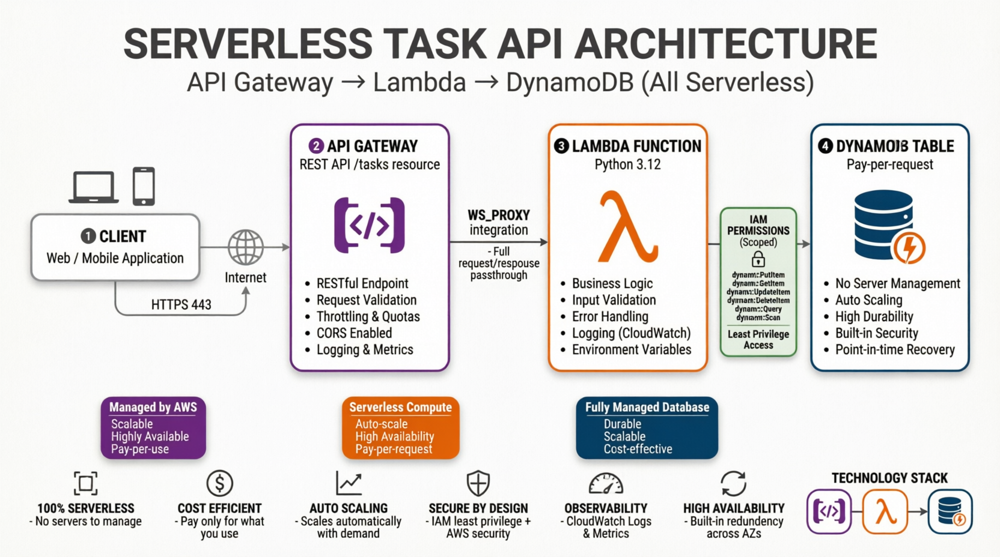

# Project 3 — Serverless Task API

A fully serverless REST API built with AWS Lambda, API Gateway, and DynamoDB —
defined entirely as code in a single CloudFormation template. No servers to patch,
no idle compute cost, scales to zero automatically.

## ArchitectureClient
| HTTPS
v
API Gateway (REST API, /tasks resource)
| AWS_PROXY integration
v
Lambda Function (Python 3.12)
| scoped IAM read/write
v
DynamoDB Table (pay-per-request)




## Endpoints

| Method | Path | Description |
|---|---|---|
| GET | /tasks | List all tasks |
| POST | /tasks | Create a task (`{"title": "..."}` body) |

## Stack contents (`template.yaml`)

| Resource | Purpose |
|---|---|
| `TasksTable` | DynamoDB table, pay-per-request billing (no capacity planning needed) |
| `LambdaExecutionRole` | Scoped IAM role — only GetItem/PutItem/Scan on this one table, plus CloudWatch Logs |
| `TasksFunction` | The Lambda function running the API logic |
| `TasksApi` / `TasksResource` / `Get|PostTasksMethod` | API Gateway REST API wired to Lambda via AWS_PROXY integration |
| `LambdaApiPermission` | Explicitly grants API Gateway permission to invoke the Lambda (required — not automatic) |
| `ApiDeployment` / `ApiStage` | Publishes the API to a live `prod` stage URL |

## Deploy

**1. Package and upload the Lambda code**
```bash
cd lambda
zip function.zip handler.py
cd ..
aws s3 mb s3://your-lambda-deployments-bucket
aws s3 cp lambda/function.zip s3://your-lambda-deployments-bucket/function.zip
```

**2. Deploy the stack**
```bash
aws cloudformation create-stack \
  --stack-name project3-serverless-api \
  --template-body file://template.yaml \
  --capabilities CAPABILITY_IAM \
  --parameters ParameterKey=LambdaCodeBucket,ParameterValue=your-lambda-deployments-bucket
```

**3. Get the API URL**
```bash
aws cloudformation describe-stacks \
  --stack-name project3-serverless-api \
  --query "Stacks[0].Outputs"
```

## Test

```bash
# List tasks
curl https://<api-url>/prod/tasks

# Create a task
curl -X POST https://<api-url>/prod/tasks \
  -H "Content-Type: application/json" \
  -d '{"title": "Learn CloudFormation"}'
```

## Updating the Lambda code

Changing `handler.py` requires re-zipping, re-uploading to S3, then telling Lambda to pick up the new version:

```bash
cd lambda && zip function.zip handler.py && cd ..
aws s3 cp lambda/function.zip s3://your-lambda-deployments-bucket/function.zip
aws lambda update-function-code --function-name tasks-api-handler --s3-bucket your-lambda-deployments-bucket --s3-key function.zip
```

## Tear down

```bash
aws cloudformation delete-stack --stack-name project3-serverless-api
aws s3 rm s3://your-lambda-deployments-bucket --recursive
aws s3 rb s3://your-lambda-deployments-bucket
```

## Cost

This is essentially free at portfolio-demo traffic levels. DynamoDB pay-per-request,
Lambda's free tier includes 1M requests/month, API Gateway's free tier includes 1M
calls/month for the first year. Nothing runs (and nothing is billed) when idle.

## What this project demonstrates

- Serverless architecture (Lambda + API Gateway + DynamoDB)
- Infrastructure as Code for non-EC2, event-driven compute
- Least-privilege IAM scoped to a single table's specific actions
- REST API design and AWS_PROXY Lambda integration
- Separating deployment artifacts (Lambda zip in S3) from infrastructure definition

